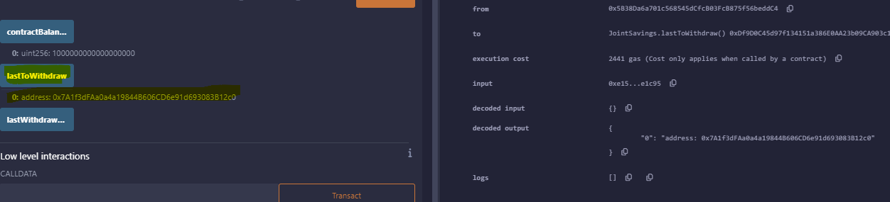
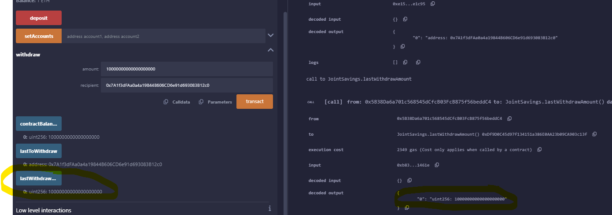

# Joint_Savings_Account


Module 20 Challenge - Smart Contracts in Solidity

## Table of Contents 
1. [Background](#background)
2. [Implementation Steps](#implementation-steps)
3. [Conclusion](#conclusion)
4. [Code](#code)


## Background 
Creation of JointSavings Smart Contract:

As part of our fintech startup company's initiative to disrupt the finance industry, I was tasked with developing a Solidity smart contract to automate the management of joint savings accounts. Our blockchain-based solution aims to streamline financial processes by allowing two users to control a joint savings account and perform operations such as depositing and withdrawing funds.

To fulfill this objective, I developed the JointSavings smart contract using Solidity. This contract enables the creation and management of a joint savings account, providing essential functionalities for depositing and withdrawing funds. Additionally, the contract tracks crucial account details, including the last withdrawal recipient and amount, along with the current contract balance.

## Implementation Steps:

### Step 1: Creating the JointSavings Contract:
A new contract named JointSavings was defined, encompassing several variables. These include two address payable variables for account holders, an address variable for the last withdrawal recipient, and two uint variables for tracking withdrawal amounts and contract balance.

The withdraw function was implemented to facilitate fund withdrawals from the joint savings account, while the deposit function allows users to deposit funds into the account.

Furthermore, the setAccounts function was added to establish the authorized Ethereum addresses for managing the joint savings account. Additionally, a fallback function enables the contract to receive ether sent from outside the deposit function.

### Step 2: Compiling and Deploying the Contract:
I compiled the smart contract in the Remix IDE, ensuring successful compilation by resolving any errors in the code.
Using the Remix IDE's "Deploy & Run Transactions" pane, I deployed the smart contract in the Remix - Berlin VM environment.

### Step 3: Interacting with the Deployed Contract:
I tested the functionality of the deployed smart contract by interacting with it.
The setAccounts function was used to define the authorized Ethereum addresses for managing the joint savings account.
I tested the deposit functionality by depositing various amounts of ether into the joint savings account and verified the updated contract balance.
Testing the withdrawal functionality involved withdrawing funds from the joint savings account and verifying the correct recipient and amount using the lastToWithdraw and lastWithdrawAmount functions.
Execution Results:
I captured screenshots of the execution results at each step, including the successful deployment of the contract, deposit transactions, withdrawal transactions, and verification of contract state. These screenshots are stored in the Execution_Results folder.

### ***To interact with your deployed smart contract, complete the following steps:***
---

---
1. Use the `setAccounts` function to define the authorized Ethereum address that will be able to withdraw funds from your contract.

     > **Note** You can either use the following Ethereum addresses or create new, dummy addresses on the [Vanity-ETH](https://vanity-eth.tk/) website, which includes an Ethereum vanity address generator.
    >
    > ```text
    > Dummy account1 address: 0x0c0669Cd5e60a6F4b8ce437E4a4A007093D368Cb
    > Dummy account2 address: 0x7A1f3dFAa0a4a19844B606CD6e91d693083B12c0
    > ```
----    


2. Test the deposit functionality of your smart contract by sending the following amounts of ether. After each transaction, use the `contractBalance` function to verify that the funds were added to your contract:

* Transaction 1: Send 1 ether as wei.


* Transaction 2: Send 10 ether as wei.


* Transaction 3: Send 5 ether.


 
3. Once you’ve successfully deposited funds into your contract, test the contract’s withdrawal functionality.

- 1. Withdraw 5 ether into `accountOne`. use the `contractBalance` function to verify that the funds were withdrawn from your contract.


- 2. Withdraw 10 ether into `accountTwo`. After each transaction, use the `contractBalance` function to verify that the funds were withdrawn from your contract. 


4. Test the `lastToWithdraw` function to verify that the address was correct.



5. Test the `lastWithdrawAmount` function to verify that the last amount withdrawn was correct.



## Conclusion:
In conclusion, I successfully developed a Solidity smart contract for managing joint savings accounts, contributing to our fintech startup's goal of automating financial processes. The contract provides essential functionality for depositing and withdrawing funds, ensuring secure and transparent financial transactions between multiple users on our blockchain platform.

## Code
**File Link:** [Joint Savings](joint_savings.sol)